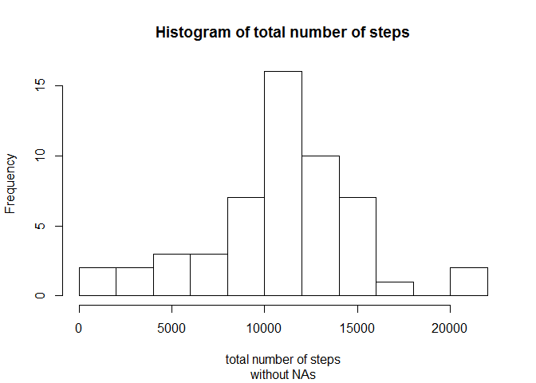
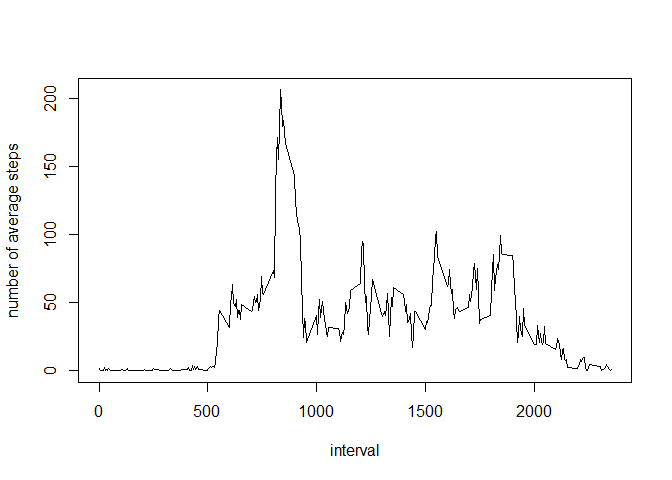
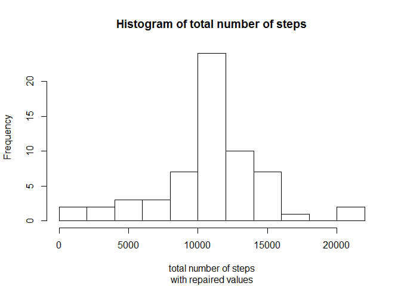
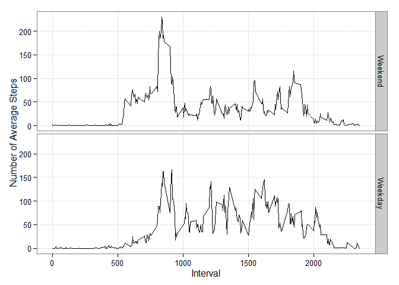

# Reproducible Research: Peer Assessment 1
*author: Sergey Medintsev*  
*date:   14.08.2015*


## Loading and preprocessing the data

```r
data          <- read.csv('activity.csv')
data$date     <- as.Date(data$date)
data.noNA     <- na.omit(data)
```


## What is mean total number of steps taken per day?

```r
data.aggr.days     <- aggregate(x   = data.noNA$steps,
                                by  = list(data.noNA$date),
                                FUN = sum)
hist(x    = data.aggr.days$x,
     xlab = 'total number of steps',
     main = 'Histogram of total number of steps',
     sub  = 'without NAs',
     breaks = 11)
```

 

```r
mean(data.aggr.days$x)
```

```
## [1] 10766.19
```

```r
median(data.aggr.days$x)
```

```
## [1] 10765
```


## What is the average daily activity pattern?

```r
data.aggr.intervals     <- aggregate(x    = data.noNA$steps,
                                     by   = list(data.noNA$interval),
                                     FUN  = mean)
names(data.aggr.intervals)[1] <- "interval"
plot(data.aggr.intervals, type = "l", ylab = 'number of average steps')
```

 

```r
data.aggr.intervals$interval[which.max(data.aggr.intervals$x)]
```

```
## [1] 835
```


## Imputing missing values

```r
sum(is.na(data))
```

```
## [1] 2304
```

We are going to impute these missing values using average steps by interval.


```r
data.repaired <- merge(x      = data,
                       y      = data.aggr.intervals,
                       by     = "interval",
                       all.x  = TRUE)
data.repaired$steps_repaired <- ifelse(is.na(data.repaired$steps),
                                       as.integer(data.repaired$x),
                                       data.repaired$steps)
data.aggr.days.repaired <- aggregate(x   = data.repaired$steps_repaired,
                                     by  = list(data.repaired$date),
                                     FUN = sum)
hist(x    = data.aggr.days.repaired$x,
     xlab = 'total number of steps',
     ylim = c(0,24),
     main = 'Histogram of total number of steps',
     sub  = 'with repaired values',
     breaks = 11)
```

 

```r
mean(data.aggr.days.repaired$x)
```

```
## [1] 10749.77
```

```r
median(data.aggr.days.repaired$x)
```

```
## [1] 10641
```

The histogram overall is very similar to the one we generated earlier, execept that we have far less days falling into the zero steps bucket. This makes sense because we imputed NA with interval average, which shifted mean up quite a bit while kept median roughly the same.

## Are there differences in activity patterns between weekdays and weekends?

```r
data.repaired$weekday <- weekdays(data.repaired$date, abbreviate = TRUE)
data.repaired$weekday <- ifelse(data.repaired$weekday == 'Сб' | data.repaired$weekday == 'Вс', 1, 0)
data.repaired$weekday <- factor(data.repaired$weekday, labels = c("Weekend", "Weekday"))
data.aggr.weekdays.repaired <- aggregate(x   = data.repaired$steps_repaired,
                                     by  = list(data.repaired$weekday, data.repaired$interval),
                                     FUN = mean)
names(data.aggr.weekdays.repaired) <- c('weekday', 'interval', 'steps')
library(ggplot2)
ggplot(data.aggr.weekdays.repaired, aes(interval, steps)) +
  geom_line() +
  facet_grid(weekday ~ .) +
  theme_bw() +
  labs(x = "Interval",
       y = "Number of Average Steps")
```

 
